# Beauty by Kabylova — Букинг-лендинг

> Профессиональный лендинг с системой онлайн-записи для beauty-мастера в Астане

**Стек:** Django 5.2 · PostgreSQL/SQLite · Gmail SMTP · GSAP · Render.com

**Instagram:** [@by_kabylova](https://www.instagram.com/by_kabylova)

**Адрес:** г. Астана, ул. Байтурсынова 17/1

---

## Скриншоты

### Главный экран (Hero)
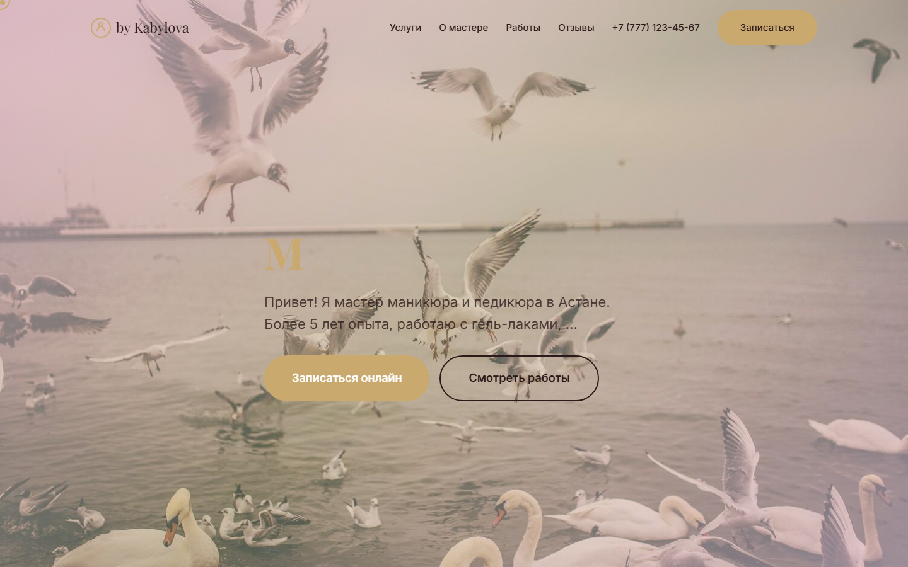

### Услуги
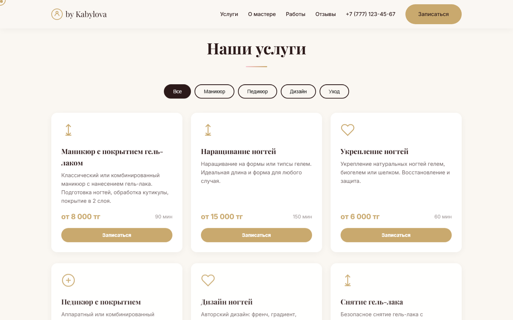

### О мастере
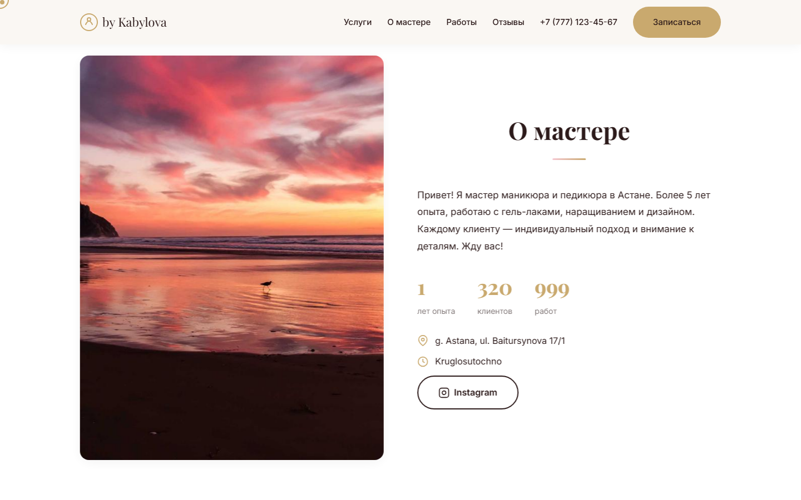

### Галерея работ
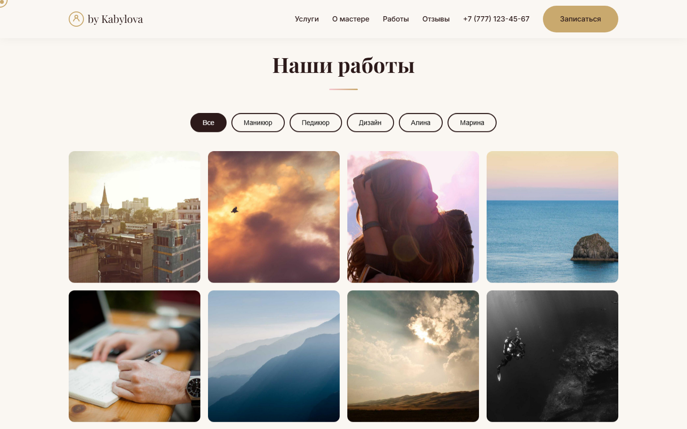

### Как записаться
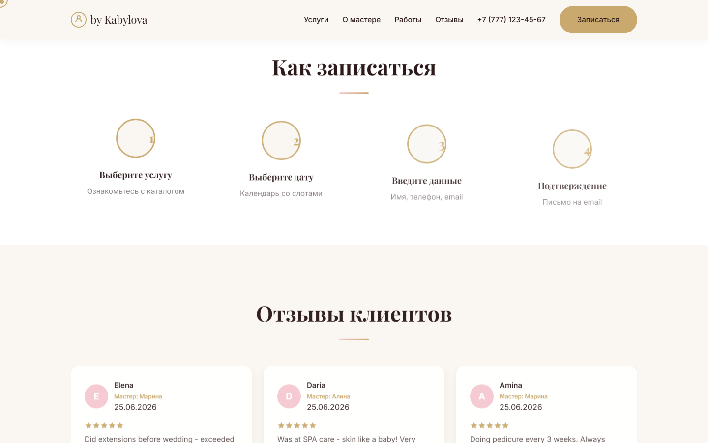

### Отзывы
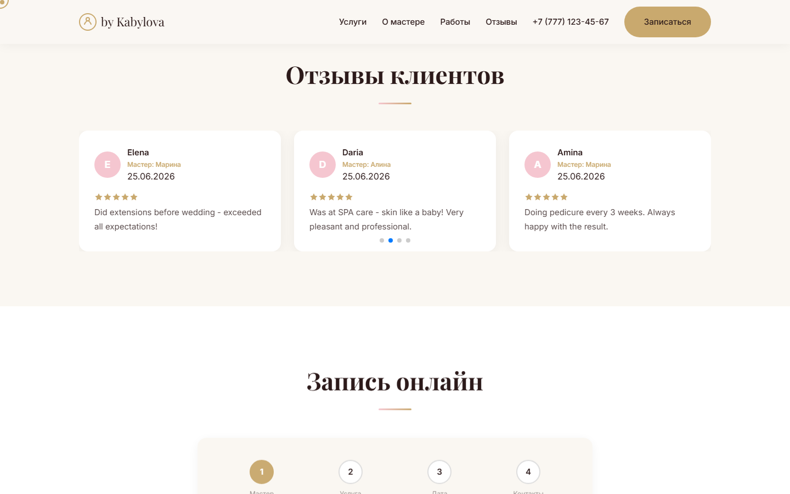

### Форма записи — выбор мастера
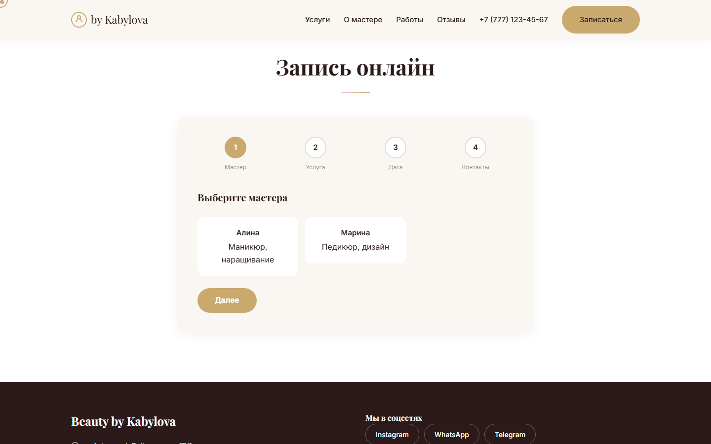

### Форма записu — выбор услуги
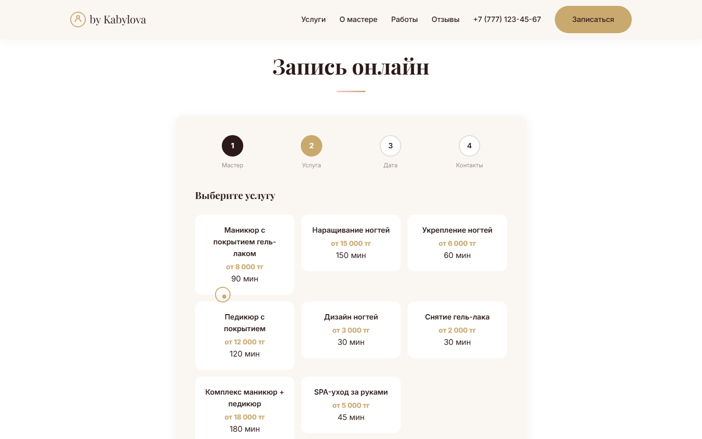

### Форма записи — дата и время
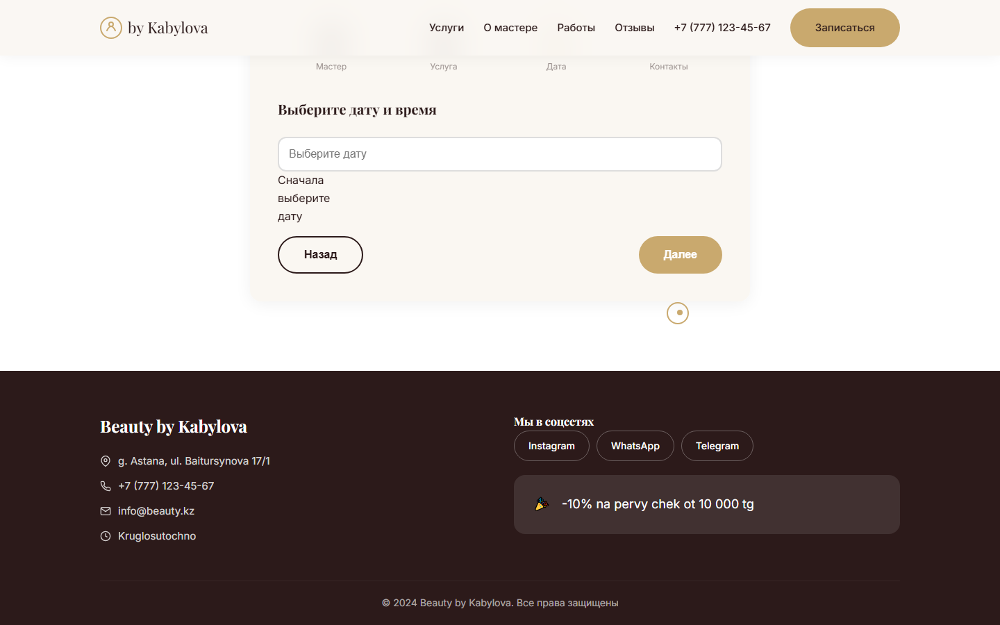

### Форма записи — контактные данные
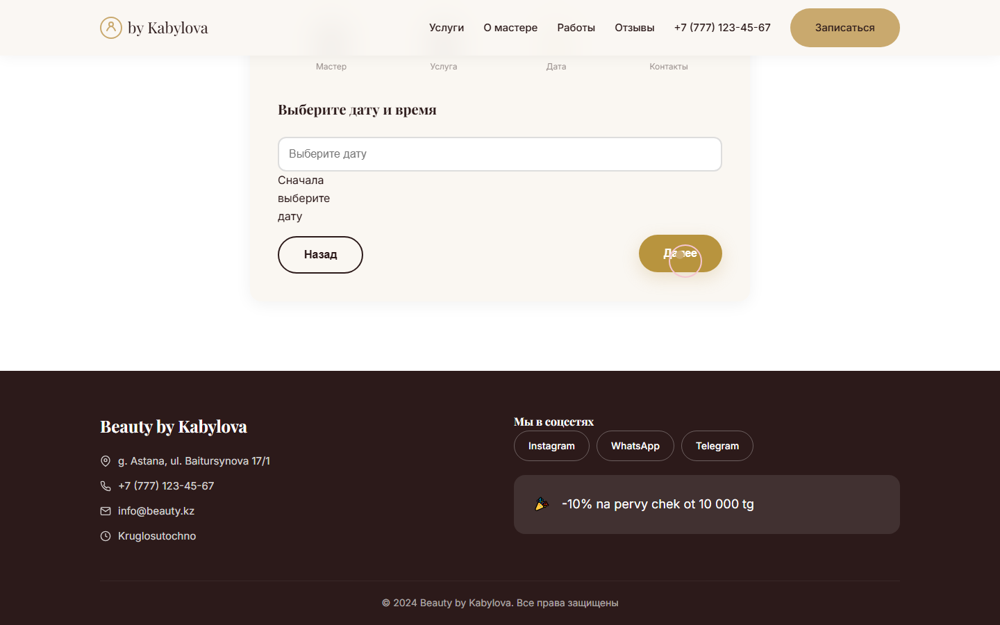

### Модальное окно после записи


### Админка — записи с цветными статусами
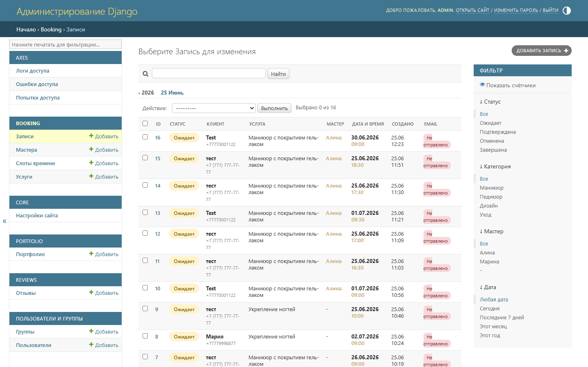

### Админка — мастера
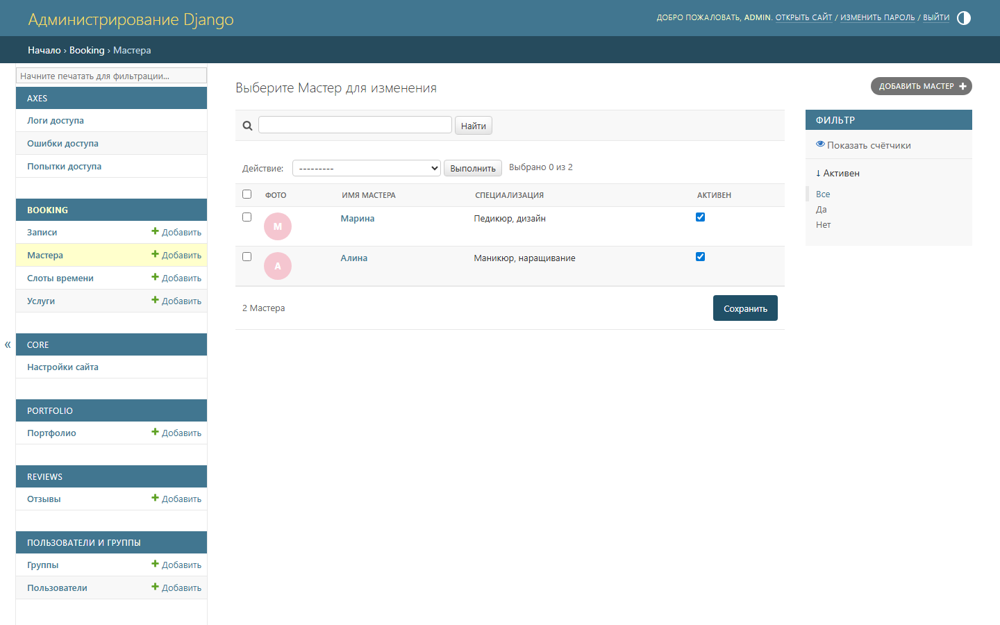

### Админка — настройки сайта
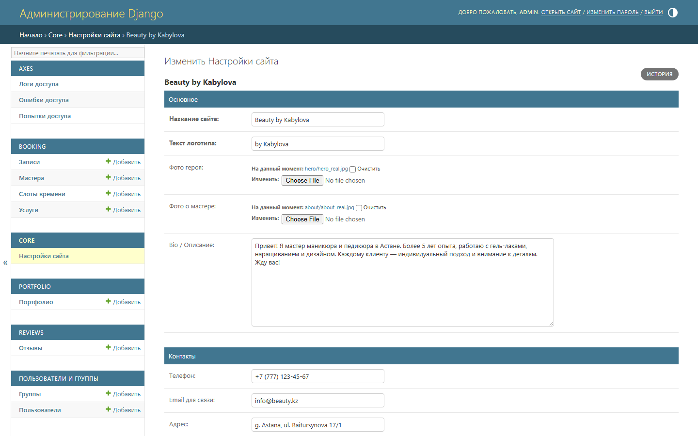

### Мобильная версия
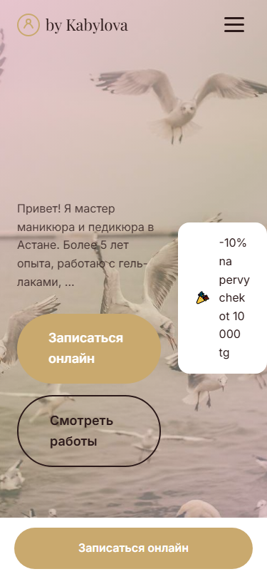

---

## Демо

**Сайт:** http://localhost:8000

**Админ-панель:** http://localhost:8000/admin/

**Логин:** admin / admin123

---

## Что было сделано

### 1. Лендинг (8 секций)

| Секция | Описание |
|--------|----------|
| **Hero** | Полноэкранный баннер с фото, розовым оверлеем, typewriter-эффектом |
| **Услуги** | 8 услуг с ценами, фильтрами и 3D hover |
| **О мастере** | Bio, фото, анимированные счётчики, адрес, Instagram |
| **Галерея** | 12 фото, Masonry, фильтры по категориям и мастерам, GLightbox |
| **Как записаться** | 4 шага с SVG-прогрессом |
| **Отзывы** | Swiper.js карусель с рейтингами |
| **Запись** | 4-шаговая форма: Мастер → Услуга → Дата/время → Контакты |
| **Контакты** | Адрес, телефон, соцсети |

### 2. Система записи

- **4-шаговая форма** с прогресс-баром
- **Выбор мастера** — Алина (маникюр) и Марина (педикюр)
- **Календарь Flatpickr** с русской локализацией
- **AJAX-загрузка слотов** при выборе даты
- **Автогенерация слотов** — при создании мастера (9:00–21:30, 2 недели)
- **Фильтрация прошедших слотов** — сегодня после обеда утренние не показываются
- **Race-condition защита** — select_for_update()
- **Маска телефона** — +7 (___) ___-__-__
- **Honeypot** — защита от спам-ботов

### 3. Модальное окно

- Кнопки **WhatsApp и Telegram** для связи
- Закрывается: X, кликом вне окна, кнопкой «Отлично»
- Не конфликтует с баннером (z-index: 10002)

### 4. Gmail SMTP

- HTML-письма с градиентным дизайном
- Клиенту: подтверждение + ссылка отмены (7 дней)
- Администратору: уведомление о новой записи
- Если SMTP не настроен — запись создаётся, письмо помечается «не отправлено»

### 5. Django Admin (всё на русском)

- **Мастера** — аватар, имя, специализация
- **Услуги** — категория, цена, привязка к мастерам
- **Записи** — цветные бейджи, клиент, дата, email статус
- **Слоты** — экшн «Сгенерировать на 2 недели»
- **Портфолио** — фото, категория, мастер
- **Отзывы** — рейтинг, модерация
- **Настройки** — название, лого, тексты, фото, контакты, соцсети
- **CSV экспорт** — UTF-8 BOM (Excel без иероглифов)

### 6. Динамические данные (всё через Admin)

| Поле | Где отображается |
|------|-----------------|
| Название сайта | Шапка, футер |
| Лого (SVG) | Навбар |
| Фото героя | Hero + розовый оверлей |
| Фото о мастере | About |
| Bio | Hero + About |
| Телефон | Навбар, футер |
| Адрес | About, футер |
| Режим работы | About, футер |
| Акция | Hero badge, футер |
| Статистика | Анимированные счётчики |
| Instagram, WhatsApp, Telegram, VK, Facebook, TikTok, YouTube | Модалка, футер |

> Если поле не заполнено — не отображается

### 7. Дизайн

- **Палитра:** слоновая кость · пудровый розовый · матовое золото · шоколад
- **Типографика:** Playfair Display + Inter
- **12+ анимаций:** parallax, typewriter, 3D hover, Masonry, курсор, badge, progress, counter
- **Mobile-first:** 480px, 768px, 1024px
- **prefers-reduced-motion** — анимации отключаются

### 8. Безопасность

CSRF · axes · honeypot · CSP · HSTS · TimestampSigner · select_for_update · Django ORM

### 9. SEO

HTML5 семантика · Open Graph · canonical · lazy loading · alt атрибуты

---

## Установка

```bash
git clone https://github.com/AtazhanErbol/New-project-.git
cd New-project-
python -m venv venv
source venv/bin/activate
pip install -r requirements.txt
python manage.py migrate
python manage.py createsuperuser
python manage.py runserver
```

## Тесты

```bash
python manage.py test apps.booking
```

## Демо-наполнение сайта (чтобы показать клиенту)

Заполняет сайт демо-контентом: 2 мастера, 8 услуг, 12 работ в портфолио, 7 отзывов
и настройки сайта — с автоматически сгенерированными placeholder-фото (брендовые
цвета + подпись), чтобы сайт не выглядел пустым.

```bash
python manage.py seed_demo_data
```

> Фото — временные заглушки. Замените их на настоящие через админку
> (`/admin/`), когда они будут готовы — просто загрузите новое фото
> в нужной карточке (Мастер, Услуга, Портфолио, Отзыв).

## Продление сетки слотов (запускать по cron раз в день/неделю)

```bash
python manage.py generate_slots
```

## Настройка почты (.env)

```env
EMAIL_HOST_USER=your-gmail@gmail.com
EMAIL_HOST_PASSWORD=your-app-password
ADMIN_EMAIL=admin@example.com
```

## Деплой на Render

```bash
# Автоматический через render.yaml
# Нужно: PostgreSQL, переменные окружения
```

> В продакшен-режиме (`config.settings.production`) переменная окружения `ALLOWED_HOSTS`
> обязательна — без неё приложение не запустится (раньше был небезопасный плейсхолдер).

## Деплой на PythonAnywhere

Используются настройки `config.settings.pythonanywhere` (SQLite, без HSTS/SSL-редиректа —
PythonAnywhere сам терминирует HTTPS).

1. Зарегистрироваться на pythonanywhere.com (Beginner — бесплатно).
2. Открыть **Bash console** и выполнить:
   ```bash
   git clone https://github.com/AtazhanErbol/New-project-.git
   cd New-project-
   mkvirtualenv --python=python3.12 venv
   pip install -r requirements.txt
   ```
3. Создать файл `.env` в корне проекта (`nano .env`):
   ```env
   DJANGO_SECRET_KEY=сгенерированный-секретный-ключ
   EMAIL_HOST_USER=your-gmail@gmail.com
   EMAIL_HOST_PASSWORD=your-app-password
   ADMIN_EMAIL=admin@example.com
   ```
4. Выполнить миграции и собрать статику:
   ```bash
   export DJANGO_SETTINGS_MODULE=config.settings.pythonanywhere
   python manage.py migrate
   python manage.py collectstatic --noinput
   python manage.py createsuperuser
   ```
5. На вкладке **Web** создать новое приложение → Manual configuration → Python 3.12,
   указать virtualenv `venv`, открыть WSGI-файл и заменить его содержимое на:
   ```python
   import os
   import sys

   path = '/home/<username>/New-project-'
   if path not in sys.path:
       sys.path.insert(0, path)

   os.environ['DJANGO_SETTINGS_MODULE'] = 'config.settings.pythonanywhere'

   from django.core.wsgi import get_wsgi_application
   application = get_wsgi_application()
   ```
6. В разделе **Static files** вкладки Web добавить:
   - URL `/static/` → Directory `/home/<username>/New-project-/staticfiles`
   - URL `/media/` → Directory `/home/<username>/New-project-/media`
7. Нажать **Reload**.

> Бесплатный тариф: нет cron — `generate_slots` нужно запускать вручную через Bash console
> раз в 1–2 недели; обновление кода — `git pull` + Reload (без авто-деплоя).

---

**Автор:** AtazhanErbol
**Год:** 2024
